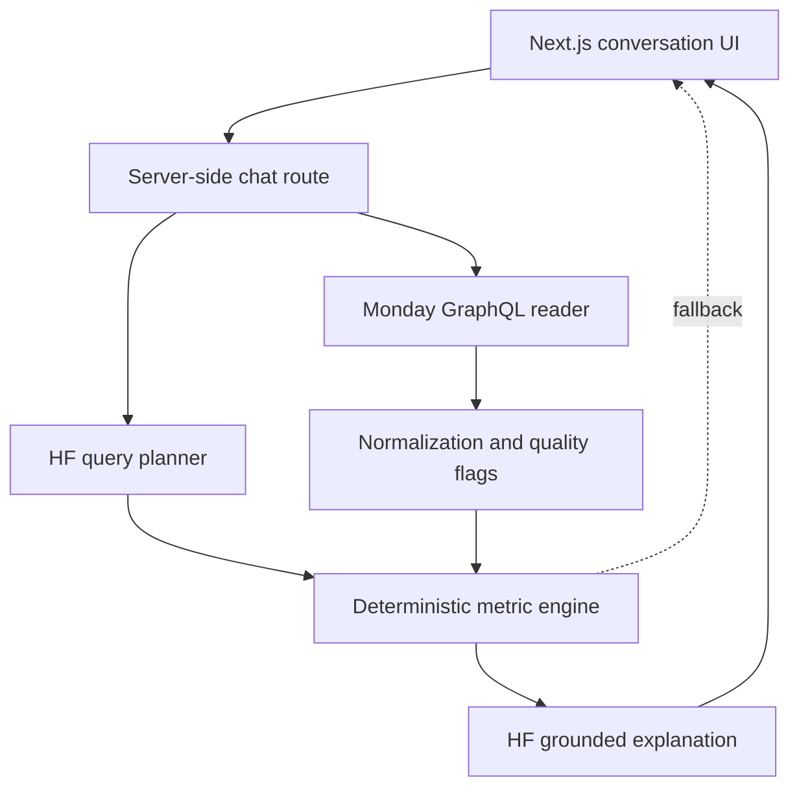

# Skylark Intelligence - Monday.com Business Intelligence Agent

A hosted, read-only conversational BI agent for founder-level questions across live Deals and Work Orders boards. It handles messy records through explicit normalization, computes metrics deterministically, and uses a Hugging Face-hosted language model to interpret questions and explain results.

## What it does

- Answers pipeline, sector, revenue, collections, and operational questions.
- Combines Deals and Work Orders when the question requires cross-board context.
- Interprets relative periods such as “this quarter” into exact dates.
- Treats “energy” as Powerline + Renewables and discloses the scope.
- Produces concise leadership updates with KPIs, risks, and actions.
- Flags missing deal values, missing probabilities, missing dates, negative billing, and incomplete receivables.
- Shows board-level row lineage for each response.
- Degrades gracefully: if inference fails, deterministic query parsing and computed answers remain available.

## Architecture



The LLM never calculates authoritative totals. It creates a typed query plan and narrates facts supplied by the metric engine. All credentials and third-party requests live in server-only code.

## Stack

- Next.js 15, React 19, TypeScript
- Monday.com GraphQL API with cursor pagination
- Hugging Face Inference Providers using `openai/gpt-oss-120b:cheapest`
- Zod validation
- Vitest unit tests
- Vercel deployment

## Local setup

Requirements: Node.js 20+ and npm.

```bash
npm install
cp .env.example .env.local
npm run dev
```

Fill `.env.local` with the variables documented in [docs/MONDAY_SETUP.md](docs/MONDAY_SETUP.md). Never commit `.env.local`.

## Monday configuration

Follow [docs/MONDAY_SETUP.md](docs/MONDAY_SETUP.md) to import the two workbooks, choose column types, retrieve board IDs, create a token, and configure Vercel.

## Validation

```bash
npm test
npm run lint
npm run build
```

Suggested acceptance prompts:

1. How is our energy sector pipeline looking this quarter?
2. What is our weighted pipeline for mining, and how complete is the data?
3. Where is receivables risk concentrated?
4. How many work orders are overdue and not completed?
5. Prepare a concise leadership update.

## Metric definitions

- **Active pipeline:** Open + On Hold deals matching the selected sector/date scope.
- **Weighted pipeline:** Deal value × closure weight. High = 75%, Medium = 50%, Low = 25%; missing probability = 30% and is explicitly flagged.
- **Overdue pipeline:** Active deal whose tentative close date is before the analysis date.
- **Schedule risk:** Work order whose probable end date is before the analysis date and execution is not completed.
- **Billed ratio:** Recorded amount to be billed / recorded total order value.
- **Collection ratio:** Collected / (collected + receivable), using only recorded values.

These definitions are intentionally visible rather than hidden inside prompts.

## Failure handling and privacy

- Monday or Hugging Face failures return actionable messages without exposing secrets.
- No write mutations are sent to Monday.com.
- No workbook data is bundled or hardcoded into the application.
- Source data is fetched afresh for each question.
- The app sends only compact computed facts to the explanation model, not the full boards.
- The model fallback preserves core BI availability if Hugging Face is unavailable or credits are exhausted.

## Deployment

1. Push this project to a private Git repository.
2. Import the repository into Vercel.
3. Add all environment variables from `.env.example` in Vercel Project Settings.
4. Deploy and open `/api/status` to verify `ready: true`.
5. Run the acceptance prompts above.

## Repository map

- `src/lib/monday.ts` - authenticated, paginated, read-only GraphQL access
- `src/lib/normalize.ts` - column discovery, canonicalization, quality flags
- `src/lib/ai.ts` - query planning, model routing, deterministic fallback
- `src/lib/analytics.ts` - business metric definitions and calculations
- `src/app/api/chat/route.ts` - orchestration and error handling
- `src/components/intelligence-console.tsx` - conversational executive UI
- `tests/` - normalization and analytics unit tests
- `docs/DECISION_LOG.pdf` - required two-page decision log

## Known constraints

- Personal Monday tokens inherit the user's full UI permissions; production use should move to OAuth with tightly scoped app permissions.
- Semantic column matching tolerates title variations but cannot recover an entirely renamed or deleted business field.
- Cross-board joins are sector/owner/aggregate based because the supplied masked IDs do not expose a reliable universal deal-to-work-order key.
- Currency is treated as INR because monetary work-order headings explicitly specify rupees; deal values are masked and assumed to use the same business currency.

References: [Monday authentication](https://developer.monday.com/api-reference/docs/authentication), [Monday pagination](https://developer.monday.com/api-reference/reference/items-page), [Hugging Face Inference Providers](https://huggingface.co/docs/inference-providers/en/index), [structured outputs](https://huggingface.co/docs/inference-providers/guides/structured-output), [Vercel environment variables](https://vercel.com/docs/environment-variables).
